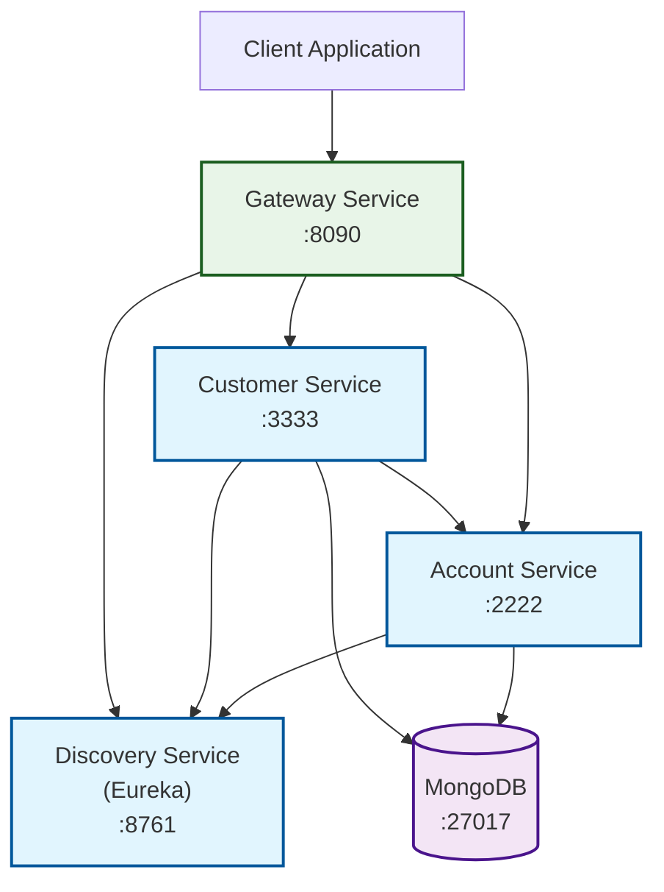

# Reactive Microservices with Spring WebFlux and Spring Cloud

[](https://circleci.com/gh/piomin/sample-spring-cloud-webflux)
[](https://sonarcloud.io/dashboard?id=piomin_sample-spring-cloud-webflux)
[](https://sonarcloud.io/dashboard?id=piomin_sample-spring-cloud-webflux)
[](https://sonarcloud.io/dashboard?id=piomin_sample-spring-cloud-webflux)
[](https://sonarcloud.io/dashboard?id=piomin_sample-spring-cloud-webflux)

A sample microservices architecture built with **Spring WebFlux** and **Spring Cloud** demonstrating reactive programming patterns, service discovery, and API gateway implementation.

**Detailed description:** [Reactive Microservices with Spring WebFlux and Spring Cloud](https://piotrminkowski.com/2018/05/04/reactive-microservices-with-spring-webflux-and-spring-cloud/)

## 🏗️ Architecture Overview

This project demonstrates a reactive microservices architecture with the following components:



### Architecture Patterns

- **Reactive Programming**: Built with Spring WebFlux for non-blocking, asynchronous processing
- **Service Discovery**: Netflix Eureka for dynamic service registration and discovery
- **API Gateway**: Spring Cloud Gateway for routing, load balancing, and cross-cutting concerns
- **Microservices**: Domain-driven service boundaries with independent data stores

## 🚀 Services

### Discovery Service (Eureka Server)
- **Port**: 8761
- **Purpose**: Service registry for microservices discovery
- **Technology**: Netflix Eureka Server
- **Endpoint**: `http://localhost:8761` (Eureka Dashboard)

### Gateway Service (API Gateway)
- **Port**: 8090
- **Purpose**: Single entry point, routing, and load balancing
- **Technology**: Spring Cloud Gateway
- **Routes**:
  - `/account/**` → Account Service
  - `/customer/**` → Customer Service

### Account Service
- **Port**: 2222
- **Purpose**: Manages customer accounts and financial data
- **Technology**: Spring WebFlux, MongoDB Reactive
- **Database**: MongoDB collection for accounts

### Customer Service
- **Port**: 3333
- **Purpose**: Manages customer information and aggregates account data
- **Technology**: Spring WebFlux, MongoDB Reactive, WebClient
- **Database**: MongoDB collection for customers
- **Dependencies**: Calls Account Service for account aggregation

## 🛠️ Technology Stack

| Technology          | Version    | Purpose                          |
|---------------------|------------|----------------------------------|
| Java                | 21         | Runtime environment              |
| Spring Boot         | 3.4.6      | Application framework            |
| Spring Cloud        | 2024.0.1   | Microservices infrastructure     |
| Spring WebFlux      | —          | Reactive web framework           |
| Spring Cloud Gateway| —          | API Gateway                      |
| Netflix Eureka      | —          | Service discovery                |
| MongoDB             | 4.0+       | NoSQL database                   |
| Maven               | 3.6+       | Build tool                       |

## 📋 Prerequisites

Before running the application locally, ensure you have:

- **Java 21** or higher
- **Maven 3.6+**
- **MongoDB 4.0+** running on `localhost:27017`

### MongoDB Setup

1. **Install MongoDB**:
   ```bash
   # macOS (Homebrew)
   brew install mongodb/brew/mongodb-community
   # Ubuntu/Debian
   sudo apt-get install mongodb
   # Windows
   Download from https://www.mongodb.com/try/download/community
   ```
2. **Start MongoDB**:
   ```bash
   # macOS/Linux
   sudo systemctl start mongod
   # or
   brew services start mongodb/brew/mongodb-community
   # Windows
   net start MongoDB
   ```
3. **Verify**:
   ```bash
   mongosh --eval "db.adminCommand('ismaster')"
   ```

## 🚀 Running Locally

### Option 1: Manual Startup (Development)

1. Clone:
   ```bash
   git clone https://github.com/piomin/sample-spring-cloud-webflux.git
   cd sample-spring-cloud-webflux
   ```
2. Build:
   ```bash
   mvn clean install
   ```
3. Start services in order:
   1. Discovery Service:
      ```bash
      cd discovery-service
      mvn spring-boot:run
      ```
   2. Account Service (new terminal):
      ```bash
      cd account-service
      mvn spring-boot:run
      ```
   3. Customer Service (new terminal):
      ```bash
      cd customer-service
      mvn spring-boot:run
      ```
   4. Gateway Service (new terminal):
      ```bash
      cd gateway-service
      mvn spring-boot:run
      ```

### Option 2: Using JARs

1. Package:
   ```bash
   mvn clean package
   ```
2. Run:
   ```bash
   java -jar discovery-service/target/discovery-service-1.1-SNAPSHOT.jar
   java -jar account-service/target/account-service-1.1-SNAPSHOT.jar
   java -jar customer-service/target/customer-service-1.1-SNAPSHOT.jar
   java -jar gateway-service/target/gateway-service-1.1-SNAPSHOT.jar
   ```

### Verification

1. Eureka Dashboard: `http://localhost:8761`
2. Gateway Health: `http://localhost:8090/actuator/health`
3. API endpoints: (see API section)

## 📡 API Documentation

All API calls go through Gateway at `http://localhost:8090`.

### Account Service APIs

| Method | Endpoint                   | Description         |
|--------|----------------------------|---------------------|
| GET    | `/account/`                | List all accounts   |
| GET    | `/account/{id}`            | Get account by ID   |
| GET    | `/account/customer/{id}`   | Accounts by client  |
| POST   | `/account/`                | Create new account  |

**Create Account Example**:
```bash
curl -X POST http://localhost:8090/account/ \
  -H "Content-Type: application/json" \
  -d '{
    "number": "1234567890",
    "amount": 5000,
    "customerId": "1"
  }'
```

### Customer Service APIs

| Method | Endpoint                             | Description               |
|--------|--------------------------------------|---------------------------|
| GET    | `/customer/`                         | List all customers        |
| GET    | `/customer/{id}`                     | Get customer by ID        |
| GET    | `/customer/{id}/with-accounts`       | Customer + accounts       |
| POST   | `/customer/`                         | Create new customer       |

**Create Customer Example**:
```bash
curl -X POST http://localhost:8090/customer/ \
  -H "Content-Type: application/json" \
  -d '{"name":"John Doe","type":"INDIVIDUAL"}'
```

## 🔧 Development & Troubleshooting

### Project Structure
```
sample-spring-cloud-webflux/
├── discovery-service/
├── gateway-service/
├── account-service/
├── customer-service/
├── pom.xml
└── readme.md
```

### Common Issues

- MongoDB not running: start service on `localhost:27017`
- Eureka startup: ensure discovery-service runs first
- Port conflicts: verify ports 8761, 8090, 2222, 3333

## 🤝 Contributing

1. Fork the repo
2. Create a branch
3. Make changes & add tests
4. Submit a PR

## 📄 License

Licensed under the MIT License. See LICENSE for details.
